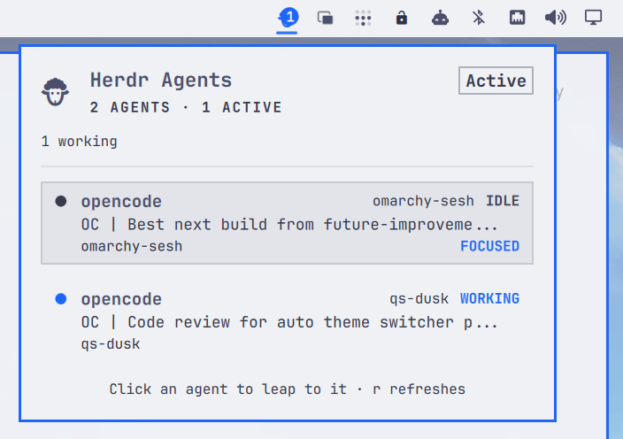

# Herdr Agents



A live agent-status widget for the [Omarchy](https://omarchy.org/) bar that
watches your [Herdr](https://herdr.dev) session.

One bar icon, one panel: every running Herdr agent with its current state,
what it is doing right now, and the Herdr workspace it is working in. Click an
agent and you land on it inside Herdr — no matter which desktop or window you
are looking at.

## Features

### Bar icon

A static sheep glyph (`󰳆`) tinted by fleet state:

- **accent** while any agent is working,
- **urgent** when any agent needs attention (blocked),
- **muted** when herdr is unreachable,
- a **count badge** of busy agents (working / blocked / done).

### Panel

Click the icon to open a list, one row per agent:

- status dot + label (`WORKING`, `BLOCKED`, `DONE`, `IDLE`, `UNKNOWN`),
- agent name,
- the agent's **current activity** (its live terminal title),
- the **Herdr workspace** it is in, and the project folder,
- a `FOCUSED` mark on the agent currently under the Herdr cursor,
- elapsed time in the current status (e.g. "3m 12s").

Blocked agents are pinned to the top. If herdr is not running, the panel
offers a **Launch Herdr** button.

Type `/` or `f` to filter agents by name, workspace, or folder. Press
Escape to clear.

### Notifications

Desktop toasts when agents change state (toggleable in plugin settings):

| Toast | When | Urgency |
| --- | --- | --- |
| **Needs attention** | agent entered `blocked` | critical |
| **Finished** | working agent transitioned to `done` | normal |
| **Agent gone** | blocked agent's pane vanished between polls | normal |
| **Herdr reconnected** | herdr came back online after being down | normal |

Clicking a **needs attention** or **finished** toast jumps straight to that
agent.

### Click to jump

Click (or keyboard-Enter) an agent row and the plugin:

1. runs `herdr agent focus <pane>` to focus the agent inside the Herdr TUI,
2. locates the Herdr terminal window and raises it with a Hyprland dispatch.

The active Hyprland workspace follows the Herdr window, so the jump works from
anywhere on the desktop — including when Herdr lives in a special workspace
(scratchpad or minimize-style setups): it is opened automatically before the
jump. If several terminals run herdr, a visible one is preferred. A failed
jump shows a desktop toast instead of silently doing nothing.

If Herdr runs on a remote host inside a local terminal (over SSH), the
process-tree lookup finds nothing locally; set the `windowClass` setting to
your terminal's window class (e.g. `ghostty`) so the window can still be
found and raised.

### IPC actions

Bind global Hyprland keybinds to jump without opening the panel:

```sh
# Jump to the first blocked agent (falls back to the first agent):
omarchy-shell ipc call mrpbennett.herdr-agents focus

# Jump to a specific agent by name:
omarchy-shell ipc call mrpbennett.herdr-agents focusAgent opencode

# Other actions: toggle, open, close, show, hide, next, refresh
```

## Settings

| Setting | Default | Description |
| --- | --- | --- |
| `refreshIntervalSec` | `2` | How often the Herdr session snapshot is polled (1–60s). |
| `notifyOnBlocked` | `true` | Toast when an agent needs attention. |
| `notifyOnFinished` | `true` | Toast when an agent finishes background work. |
| `windowClass` | *(empty)* | Fallback terminal window class when Herdr runs remotely. |

## Requirements

- [Herdr](https://herdr.dev) — the plugin polls `herdr api snapshot`.
- Omarchy with the Quickshell bar.

## Dependencies

- `herdr` — shelled out to for `herdr api snapshot` (polling) and
  `herdr agent focus <pane>` (click-to-jump). No network calls; both talk to
  the local Herdr server only.
- `hyprctl` — shelled out to by the Hyprland Window Adapter to locate and
  raise the Herdr window via a Hyprland dispatch.
- `python3` — runs `bin/omarchy-herdr-focus`, a stdlib-only script (no pip
  packages required).
- `node` — runs the Snapshot Adapter tests (`tests/test_snapshot.py`).
- No non-stdlib QML imports beyond Quickshell and the Omarchy shell's own
  `qs.Commons` / `qs.Ui` modules.

## Install

The standard way to install an Omarchy plugin, straight from the repo:

```sh
omarchy plugin add https://github.com/mrpbennett/qs-herdr-agents.git --enable
```

This clones the plugin into `~/.config/omarchy/plugins/`, validates the
manifest, rescans the shell, and enables the widget in the right bar section.
The shell hot-reloads; if the icon does not appear, run
`omarchy restart shell`.

## Update

```sh
omarchy plugin update mrpbennett.herdr-agents
```

## Uninstall

```sh
omarchy plugin remove mrpbennett.herdr-agents
```

This disables the plugin and removes it from `~/.config/omarchy/plugins/`,
leaving the rest of your `shell.json` untouched.

### Complete removal

1. **Remove the plugin** (disables and removes the installed copy):

   ```sh
   omarchy plugin remove mrpbennett.herdr-agents
   ```

2. **Remove the cloned repository** (the source code on disk):

   ```sh
   rm -rf ~/path/to/qs-herdr-agents
   ```

3. **Restart the shell** (optional, picks up the change immediately):

   ```sh
   omarchy restart shell
   ```

## Architecture

The codebase is split into focused modules with narrow interfaces:

| Module | Purpose |
| --- | --- |
| `snapshot.js` | **Snapshot Adapter** — stateless pure functions for parsing `herdr api snapshot` output, building per-pane agent records, and diffing consecutive snapshots. Imported by `Service.qml` as `Snap`. |
| `hyprland.py` | **Hyprland Window Adapter** — class-based module (`HyprlandWindow`) owning all Hyprland interaction: client discovery, process tree inspection, ranking, special workspace management, and window raising. |
| `bin/omarchy-herdr-focus` | **Focus Helper** — thin orchestrator that focuses the agent inside Herdr TUI, then delegates to `HyprlandWindow` for window discovery and raising. |
| `Service.qml` | **Data Layer** — polls `herdr api snapshot`, delegates parsing to the Snapshot Adapter, keeps the ListModel in sync, detects state transitions, emits toasts. |
| `Panel.qml` | **UI** — bar icon and agent list panel. |

### Data source

One call per poll — `herdr api snapshot` — returns every agent (state,
current activity title, cwd, pane id) and every workspace (label) from the
running Herdr server. See `docs/design.md` for the verified API details and
Hyprland 0.56 focus mechanics.

### Focus mechanics

1. `herdr agent focus <paneId>` moves Herdr's cursor to the agent's
   workspace/tab/pane.
2. The helper scans `hyprctl -j clients` and walks each client's `/proc`
   tree for a process named `herdr`, scoring matches (visible normal
   workspace preferred over special, hidden, or unmapped).
3. If the chosen window lives in a hidden special workspace, it is opened
   first.
4. Fallback: if no process tree matches, the best-ranked client matching the
   `windowClass` setting is used (for Herdr over SSH).
5. `hl.dsp.focus({ window = "address:0x..." })` raises the window and
   switches the active workspace.

## Development

Run the tests and static checks:

```sh
PYTHONDONTWRITEBYTECODE=1 python3 -m unittest discover -s tests -v
bash -n install.sh uninstall.sh
omarchy plugin validate .
git diff --check
```

## License

MIT — see [LICENSE](./LICENSE).
